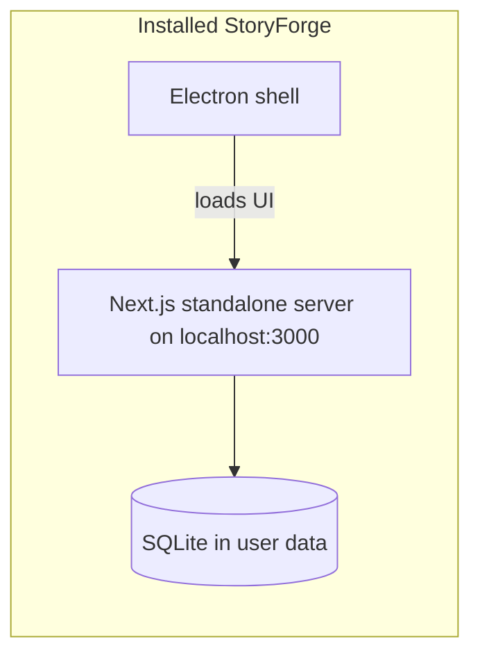

# Building a Windows installer (.exe) for StoryForge

StoryForge ships as a **desktop app**: a Next.js web app bundled inside **Electron**. For Windows, **electron-builder** produces an **NSIS installer** (a setup `.exe` you run to install the app on a PC).

This guide covers building that installer from source on your development machine. You do **not** need to deploy to a cloud host—the installed app runs entirely on the user’s computer.

## Where is the .exe file?

After a successful `npm run electron:build:win`, open the **`dist`** folder at the **root of the repo** (same level as `package.json`). electron-builder writes all Windows output there (`directories.output` in [`electron-builder.config.js`](../electron-builder.config.js)).

### Installer (this is what you share)

The file you distribute is the **NSIS setup** executable in `dist/`:

```
<repo-root>\dist\StoryForge Setup 0.1.0.exe
```

Example if you cloned to `e:\code\novel`:

```
e:\code\novel\dist\StoryForge Setup 0.1.0.exe
```

The version in the filename comes from `version` in [`package.json`](../package.json) (currently `0.1.0`). When you bump the app version, the installer name changes to match (e.g. `StoryForge Setup 0.2.0.exe`).

Double-click **that** `.exe` on another PC to install StoryForge. It is not inside `win-unpacked`.

### App binary without installing (optional)

electron-builder also writes an unpacked copy for testing:

```
<repo-root>\dist\win-unpacked\StoryForge.exe
```

That is the app itself, not an installer. Use it to smoke-test a build on your machine; for other people, give them **`dist\StoryForge Setup <version>.exe`** instead.

### After someone runs the installer

Installing copies the app under Program Files (or the folder they chose), for example:

```
C:\Users\<you>\AppData\Local\Programs\StoryForge\StoryForge.exe
```

(Exact path depends on the install directory they pick in the setup wizard.)

## What you get after a successful build

| Path under `dist/` | Purpose |
|--------------------|---------|
| `StoryForge Setup <version>.exe` | **Installer** — the `.exe` you copy and share |
| `win-unpacked\StoryForge.exe` | Unpacked app only — local testing, not for distribution |
| `win-unpacked\` (folder) | Full unpacked bundle (DLLs, resources, etc.) |

The installer lets users choose an install directory, and (by default) creates **desktop** and **Start menu** shortcuts named **StoryForge**.

Configuration lives in [`electron-builder.config.js`](../electron-builder.config.js) and [`electron/main.js`](../electron/main.js).

## Prerequisites

1. **Windows** (recommended for building the Windows installer; cross-compiling from macOS/Linux is possible but not covered here).
2. **Node.js 18+** — use a normal install from [nodejs.org](https://nodejs.org/), not only an IDE-bundled Node (see [Troubleshooting](#troubleshooting)).
3. **npm** (included with Node).
4. **Git** — clone the repo if you have not already.
5. **Disk space** — `npm install`, `next build`, and Electron packaging need several GB free.
6. **Optional for development only**: OpenAI and Anthropic API keys (end users enter keys in **Settings** after install; keys are not baked into the installer).

## One-time setup

From the project root (`e:\code\novel` or wherever you cloned the repo):

```bash
git clone <repository-url>
cd novel
npm install
```

`npm install` runs a **postinstall** step that:

- Runs `electron-builder install-app-deps` (native modules for Electron)
- Rebuilds **better-sqlite3** for your Node/Electron ABI via `scripts/rebuild-better-sqlite3.cjs`

If SQLite or native module errors appear later, run:

```bash
npm run rebuild:sqlite-node
```

### App icon (required for a clean build)

The Windows target expects:

`build-resources/icon.ico`

The repo config references this path; if the folder or icon is missing, the build may fail or use a default. Add a `.ico` (and optionally `icon.icns` / `icon.png` for other platforms) before releasing.

## Build the Windows installer

```bash
npm run electron:build:win
```

This script:

1. Runs **`next build`** — produces `.next/standalone` (see `output: 'standalone'` in [`next.config.ts`](../next.config.ts)).
2. Runs **electron-builder** with `--win` and [`electron-builder.config.js`](../electron-builder.config.js).

The process can take several minutes the first time (Next compile + Electron download + packaging).

When it finishes, the installer path is:

**`<repo-root>\dist\StoryForge Setup 0.1.0.exe`** (version from `package.json`).

### Other platforms (optional)

| Command | Output (under `dist/`) |
|---------|-------------------------|
| `npm run electron:build` | Builds targets defined in config (Windows NSIS, macOS `.dmg`, Linux AppImage) on the current OS |

macOS and Linux builds are usually run **on** those operating systems.

## Installing on a computer

1. Copy **`dist\StoryForge Setup <version>.exe`** from your build machine to the target PC (USB, network share, etc.).
2. Run the installer. Windows SmartScreen may warn for unsigned apps; that is normal unless you [code-sign](https://www.electron.build/code-signing) the binary.
3. Launch **StoryForge** from the shortcut or Start menu.
4. Open **Settings** and enter **OpenAI** and **Anthropic** API keys. Keys are stored locally in `settings.json` under the app data directory—not in the installer.

### Where data is stored (installed app)

| Mode | Database & settings location |
|------|--------------------------------|
| Development (`npm run electron:dev`) | `./.data/` in the project (e.g. `storyforge.db`, `settings.json`) |
| Installed app | Electron **user data** folder, subfolder `data/` (exact path is shown in **Settings**) |

Projects use a local **SQLite** file (`storyforge.db`). No cloud database is required.

## How the packaged app works (short)



On launch, Electron starts the bundled Next.js **`server.js`** from `resources/app/.next/standalone/`, waits until `http://localhost:3000` responds, then opens the main window. When you quit, the child server process is stopped.

## Test before you ship

**Development run** (hot reload, separate Next dev server):

```bash
npm run electron:dev
```

**Production-like run** without making an installer: after a full build, you can inspect `dist/win-unpacked/StoryForge.exe`, but the supported distribution path is the **Setup** `.exe`.

Smoke-test after building the installer:

- Install on a clean machine or VM
- Create a project, approve a stage, confirm SQLite writes
- Confirm API calls work after keys are saved in Settings

## Troubleshooting

### `better-sqlite3` / NODE_MODULE_VERSION errors

The native SQLite driver must match the Node ABI used at runtime. If terminals prefer an IDE’s older Node:

```bash
npm run rebuild:sqlite-node
```

Then rebuild the installer. Prefer **`C:\Program Files\nodejs\node.exe`** (or your system Node 18+) when running `npm install` and `npm run electron:build:win`.

### “Next.js server not found” or server fails to start

- Ensure `npm run build` completed and `.next/standalone/server.js` exists before electron-builder runs (`electron:build:win` runs build automatically).
- Do not delete `extraResources` paths in `electron-builder.config.js`; the standalone server must live **outside** `app.asar` so Node can `fork()` it.

### Build fails on missing icon

Create `build-resources/icon.ico` (256×256 or multi-size ICO recommended).

### Installer is large

Expected: the bundle includes Chromium (Electron), the Next standalone server, and dependencies. Size is typically hundreds of MB.

### Code signing (optional, for wider distribution)

Unsigned installers trigger SmartScreen. For production releases, sign the app with a Windows code-signing certificate and configure electron-builder’s `win.sign` / `certificate*` options—see [electron-builder code signing](https://www.electron.build/code-signing).

## Quick reference

```bash
# Install dependencies (once per clone)
npm install

# Dev desktop app
npm run electron:dev

# Windows installer → <repo-root>\dist\StoryForge Setup 0.1.0.exe
npm run electron:build:win
```

Related: [README.md](../README.md) (getting started), [novel_prd.md](novel_prd.md) (product / Electron notes).
