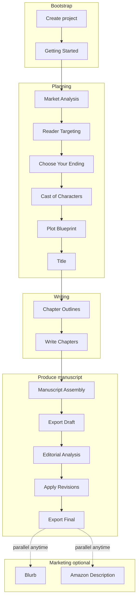
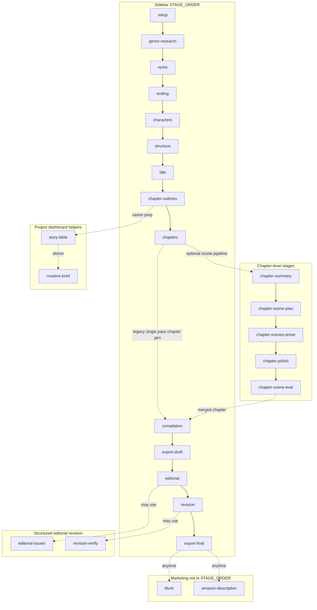

# How creating a novel works in this app

This document explains the end‑to‑end fiction workflow **as implemented today**: what you see in the sidebar, what happens inside each chapter, and which steps are helper or API-driven stages behind the scenes.

The app (**StoryForge**) treats a novel as a **project**. For each project, you move through **stages**. Earlier stages produce **documents** (genre brief, outlines, editorial reports, etc.) that later prompts reuse as context.

For goals, non-goals, and product-level requirements, see the [**Product Requirements Document**](novel_prd.md).

## Big picture

1. **You create a project** and enter basics (genre, niche, premise, optional research).
2. **Stages unlock in order** (with a few exceptions, noted below). You generate with AI, review, edit, and **approve** outputs so they become canonical for the rest of the pipeline.
3. **You write chapters** — either as **one AI pass per chapter** or a **structured scene workflow** inside each chapter screen.
4. **You assemble a manuscript**, optionally **export a draft**, run **editorial review** (single report or multi-pass pipeline), **apply revisions**, then **export final** copy.
5. **Marketing** (blurb, Amazon-style description) is available from the sidebar **whenever**; it does not block the numbered pipeline.

## Sidebar groups

The sidebar organizes work into:

| Group | Meaning |
|--------|----------|
| **Planning** | Setup through title — everything needed before drafting. |
| **Writing** | Chapter outlines plus chapter drafting; expands to **per-chapter links** once chapters exist. |
| **Editing** | Manuscript assembly, draft export, editorial, revisions, final export — plus nested **Editing passes** when multi-pass editorial is enabled. |
| **Marketing** | Blurb and Amazon description (outside the linear stage counter). |

**Project Dashboard** links to the overview for the current project (title, canon tools, shortcuts, usage, etc.).

## Main pipeline (every sidebar stage)

These are the **sequential stages** (`STAGE_ORDER`). Each row is one step in order.

| # | Stage key | What you see in the app | Plain English purpose |
|---|-----------|-------------------------|-------------------------|
| 0 | `setup` | Getting Started | Confirm genre/niche selections; add premise or research notes that steer later AI runs. |
| 1 | `genre-research` | Market Analysis | AI produces market-style analysis for your premise (demand, positioning, angles). You approve as the genre reference doc. |
| 2 | `niche` | Reader Targeting | AI turns that into reader avatar, promise, tropes to lean into or avoid. You approve as the niche reference. |
| 3 | `ending` | Choose Your Ending | AI proposes multiple endings; you pick and refine so the whole book aims at a definite landing. |
| 4 | `characters` | Cast of Characters | AI-assisted character sheets (motivations, relationships, arcs). |
| 5 | `structure` | Plot Blueprint | Beat-style structure (Save the Cat style) so you have scenes/beats before chapters. |
| 6 | `title` | Title | Title options; choosing one sets how the project is named. |
| 7 | `chapter-outlines` | Chapter Outlines | Turns the blueprint into per-chapter outlines (beats, POV goals, targets). |
| 8 | `chapters` | Write Chapters | Drafting territory: work **chapter by chapter** (details below). |
| 9 | `compilation` | Manuscript Assembly | Stitches approved chapters into one manuscript for reading/export prep. |
| 10 | `export-draft` | Export Draft | Download the work-in-progress manuscript in chosen formats. |
| 11 | `editorial` | Editorial Analysis | AI reads the manuscript and produces editorial feedback — and, depending on workflow, structured tasks for revisions. |
| 12 | `revision` | Apply Revisions | You (with AI help) resolve issues chapter by chapter, tracked as revision tasks. |
| 13 | `export-final` | Export Final | Download the polished manuscript after revisions complete. |

**Progress rule of thumb:** the app tracks a **current stage** on the project. Sidebar items **ahead** of that are locked until you advance. You can usually **jump back** to earlier stages.

**Exceptions:**

- **Compilation** may become reachable while you are still in **chapters** if **every chapter is already approved**, so you can assemble without artificially advancing stage first.
- **Export Final** unlocks after the **revision workflow** satisfies completion rules — stricter when **four-pass editorial** is enabled (must complete the full pass ladder including the final-report pass tasks).

### Multi-pass editorial (Editing passes)

Some projects run **Structural → Line edit → Copy edit → Proofread → Final report**. In the sidebar, under **Editing passes**, each pass has:

- **Review** — editorial run for that pass (linked to **Editorial Analysis** routes with `?pass=…`).
- **Revisions** — tasks for that pass (linked to **Apply Revisions** with the same pass).

Passes unlock in order: the next review only starts after the previous pass’s revisions are finished.

---

## Inside each chapter (every chapter sub-stage type)

Beyond the coarse **Write Chapters** stage, each chapter route can orchestrate finer **generation stages** — these exist in types and the generate API/prompt layer even when the UI feels like “one chapter page.”

| Stage key | Plain English role |
|-----------|---------------------|
| `chapter-summary` | Builds or refreshes running context summaries so long books stay coherent across chapters (internal helper generation). |
| `chapter-scene-plan` | Produces structured **scene cards** for one chapter instead of dumping one giant prompt. |
| `chapter-scenes-prose` | Drafts prose **per scene**, often as structured chunks you merge into the chapter. |
| `chapter-polish` | Optional pass over the stitched scene/prose bundle for smoothing. |
| `chapter-scene-eval` | Model rubric evaluation of the drafted material ( chunked/merged ); supports quality gates and diagnostics. |

**Typical authoring choice:** legacy **single-pass chapter generation** (`chapters` stage in the API) *or* the **scene pipeline** (plan → per-scene prose → optional polish → eval). Both live under **Write Chapters** from a product standpoint.

---

## Project dashboard internals (canon tooling)

Stage keys used mainly from **Project Dashboard**, not as sidebar steps:

| Stage key | Plain English role |
|-----------|---------------------|
| `story-bible` | Generates or updates a consolidated **story bible / canon document** so names, facts, and continuity stay aligned (usually after outlines are validated). |
| `creative-brief` | Builds a tighter **creative brief** derived from bible + project context — useful condensed context for later calls. |

These help the manuscript stay consistent even though they are not numbered in `STAGE_ORDER`.

---

## Editorial and revision internals (structured AI stages)

Used when firing the generate API / editorial screens with structured workflows:

| Stage key | Plain English role |
|-----------|---------------------|
| `editorial-issues` | Structured **revision-queue** generation: instead of only free-form editorial prose, emits machine-friendly issue lists/tasks from the manuscript. |
| `revision-verify` | Post-revision **checklist-style** structured pass to confirm edits landed/criteria met; often chained after revision work. |

You experience these **through** Editorial and Apply Revisions flows rather than separate sidebar pills.

---

## Marketing stages (outside the numbered pipeline)

These are explicit `WorkflowStage` values **not** inserted into linear `STAGE_ORDER`, so marketing never blocks unlocking **Export Final**:

| Stage key | Plain English role |
|-----------|---------------------|
| `blurb` | Back-cover–style pitch / short marketing blurb from your manuscript/metadata. |
| `amazon-description` | Longer product-page style description for retailers. |

---

## Full-auto mode

Projects can enable **full-auto** (see full-auto UI), which advances through many generations with minimal prompting. Checkpointing remembers where an interrupted run stopped. Under the hood it still invokes the **same conceptual stages**, including helper stages like **`revision-verify`** where configured.

---

## Process flowcharts

### 1. High-level lifecycle (milestones only)

### 2. Every stage key in one diagram (technical completeness)

Including sidebar order, chapter substages, dashboard canon, editorial/revision internals, and marketing:

(In practice, **compilation** consumes **approved** chapter content; dotted lines mean “alternate or optional wiring” rather than a strict single path.)

---

## Quick reference — list of every `WorkflowStage`

For alignment with [`src/types/index.ts`](../src/types/index.ts):

- **Sidebar pipeline:** `setup`, `genre-research`, `niche`, `ending`, `characters`, `structure`, `title`, `chapter-outlines`, `chapters`, `compilation`, `export-draft`, `editorial`, `revision`, `export-final`
- **Per chapter:** `chapter-summary`, `chapter-scene-plan`, `chapter-scenes-prose`, `chapter-polish`, `chapter-scene-eval`
- **Dashboard canon:** `story-bible`, `creative-brief`
- **Structured edit loop:** `editorial-issues`, `revision-verify`
- **Marketing:** `blurb`, `amazon-description`

For **which models and prompts each generate stage hits**, see [`docs/ai-stages-and-prompts.md`](ai-stages-and-prompts.md).
